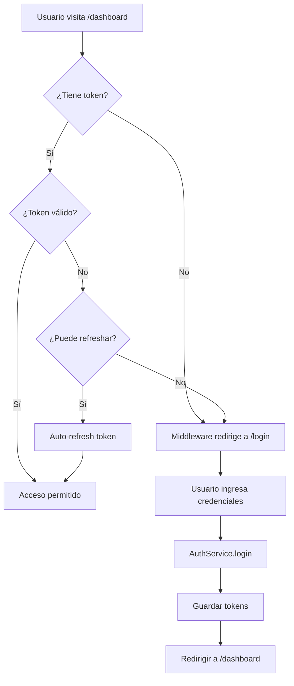

# 🔐 Sistema de Autenticación JWT - Implementación Completada

## ✅ Estado de Implementación

Se ha completado exitosamente la implementación del sistema de autenticación JWT según el plan definido en [JWT_AUTH_PLAN.md](JWT_AUTH_PLAN.md).

## 📦 Componentes Implementados

### Fase 1: Arquitectura JWT ✅

#### 1.1 Tipos y Interfaces
- ✅ [lib/auth/types.ts](lib/auth/types.ts) - Definiciones de tipos TypeScript
  - `AuthTokens` - Access + Refresh tokens
  - `AuthUser` - Datos del usuario
  - `LoginCredentials` - Credenciales de login
  - `RegisterCredentials` - Datos de registro
  - Respuestas de API

#### 1.2 Token Manager
- ✅ [lib/auth/token-manager.ts](lib/auth/token-manager.ts)
  - Gestión de tokens en localStorage/sessionStorage
  - Verificación de expiración
  - Decodificación de JWT
  - Cálculo de tiempo restante

#### 1.3 Auth Service
- ✅ [lib/auth/auth.service.ts](lib/auth/auth.service.ts)
  - Login con credenciales
  - Registro de usuarios
  - Refresh token automático
  - Obtener usuario actual
  - Logout
  - Modo mock para desarrollo

#### 1.4 HTTP Interceptor
- ✅ [lib/auth/http-interceptor.ts](lib/auth/http-interceptor.ts)
  - Auto-inyección de Bearer token
  - Auto-refresh en 401
  - Redirección a login si falla el refresh

#### 1.5 OAuth Service
- ✅ [lib/auth/oauth.service.ts](lib/auth/oauth.service.ts)
  - Login con Google OAuth
  - Login con GitHub OAuth
  - Modo mock en desarrollo (login automático)
  - Manejo de callbacks OAuth

### Fase 2: Protección de Rutas ✅

#### 2.1 Middleware de Next.js
- ✅ [middleware.ts](middleware.ts)
  - Protección de rutas privadas
  - Redirección a `/login` si no autenticado
  - Redirección a `/dashboard` si ya autenticado
  - Rutas públicas configurables

#### 2.2 Route Guard Component
- ✅ [components/auth/route-guard.tsx](components/auth/route-guard.tsx)
  - Guard de cliente para protección adicional
  - Loading spinner durante verificación
  - Redirección con URL de retorno

#### 2.3 Auth Context Actualizado
- ✅ [contexts/auth-context.tsx](contexts/auth-context.tsx)
  - Integrado con AuthService
  - Estado de autenticación reactivo
  - Auto-carga de usuario al iniciar
  - Gestión de sesión

#### 2.4 Página Raíz Actualizada
- ✅ [app/page.tsx](app/page.tsx)
  - Redirección automática a dashboard si autenticado
  - Landing page para usuarios no autenticados
  - Loading state durante verificación

#### 2.5 Perfil Integrado con Auth
- ✅ [app/(routes)/profile/page.tsx](app/(routes)/profile/page.tsx)
  - Usa `authUser.id` del contexto
  - Sin user ID hardcodeado
  - Protegido por middleware

### Fase 3: Página de Login Profesional ✅

#### 3.1 Diseño Moderno
- ✅ [app/login/page.tsx](app/login/page.tsx)
  - Glassmorphism con backdrop-blur
  - Gradientes Blue/Indigo
  - Responsive design
  - Validación de campos

#### 3.2 Características
- Email y contraseña con validación
- Toggle show/hide password
- Checkbox "Recordarme" (localStorage vs sessionStorage)
- **Botones de login social funcionales (Google, GitHub)**
  - ✅ En desarrollo: Login automático con usuario mock
  - ✅ En producción: Redirección a OAuth flow completo
  - ✅ Estados de loading separados para OAuth
  - ✅ Feedback con toasts
- Link a registro y recuperación de contraseña
- Estados de loading y error
- Toasts para feedback

#### 3.3 Animaciones CSS ✅
- Fade-in y slide-in para elementos
- Zoom-in para el logo
- Hover effects con scale
- Smooth transitions en inputs y botones
- Background gradients animados

### Fase 4: Variables de Entorno ✅

#### 4.1 Configuración
- ✅ [.env.example](.env.example) - Template con todas las variables
- ✅ [.env.local](.env.local) - Configuración local de desarrollo

#### 4.2 Variables Principales
```bash
# Backend
NEXT_PUBLIC_API_URL=http://localhost:8000
NEXT_PUBLIC_API_BASE_PATH=/api

# JWT
NEXT_PUBLIC_JWT_SECRET=dev-secret-key-change-in-production
NEXT_PUBLIC_JWT_EXPIRATION=7d

# OAuth (Opcional)
NEXT_PUBLIC_GOOGLE_CLIENT_ID=
GOOGLE_CLIENT_SECRET=
NEXT_PUBLIC_GITHUB_CLIENT_ID=
GITHUB_CLIENT_SECRET=

# Modo desarrollo (acepta cualquier credencial)
NEXT_PUBLIC_DEV_MODE=true
```

## 🚀 Uso del Sistema

### 1. Login de Usuario (Email/Password)

```typescript
import { useAuth } from '@/contexts/auth-context';

function MyComponent() {
  const { login, isLoading } = useAuth();

  const handleLogin = async () => {
    try {
      await login({
        email: 'user@example.com',
        password: 'password123',
        remember: true // localStorage vs sessionStorage
      });
      // Redirige automáticamente a /dashboard
    } catch (error) {
      console.error('Login failed:', error);
    }
  };
}
```

### 1.5 Login con OAuth (Google/GitHub)

```typescript
import { OAuthService } from '@/lib/auth/oauth.service';

function LoginButton() {
  const handleGoogleLogin = async () => {
    try {
      await OAuthService.loginWithGoogle();
      // En desarrollo: Login automático
      // En producción: Redirige a Google OAuth
    } catch (error) {
      console.error('Google login failed:', error);
    }
  };

  const handleGitHubLogin = async () => {
    try {
      await OAuthService.loginWithGitHub();
      // En desarrollo: Login automático
      // En producción: Redirige a GitHub OAuth
    } catch (error) {
      console.error('GitHub login failed:', error);
    }
  };

  return (
    <>
      <button onClick={handleGoogleLogin}>Login con Google</button>
      <button onClick={handleGitHubLogin}>Login con GitHub</button>
    </>
  );
}
```

### 2. Registro de Usuario

```typescript
const { register } = useAuth();

const handleRegister = async () => {
  try {
    await register({
      name: 'Juan Pérez',
      email: 'juan@example.com',
      password: 'password123',
      passwordConfirm: 'password123'
    });
    // Redirige automáticamente a /dashboard
  } catch (error) {
    console.error('Registration failed:', error);
  }
};
```

### 3. Obtener Usuario Actual

```typescript
const { user, isAuthenticated } = useAuth();

if (isAuthenticated) {
  console.log('User:', user.name, user.email);
}
```

### 4. Logout

```typescript
const { logout } = useAuth();

const handleLogout = async () => {
  await logout();
  // Redirige automáticamente a /login
};
```

### 5. Llamadas a API Protegidas

```typescript
import { HttpInterceptor } from '@/lib/auth/http-interceptor';

// El interceptor agrega automáticamente el Bearer token
const response = await HttpInterceptor.fetch(
  `${process.env.NEXT_PUBLIC_API_URL}/api/negocios`,
  {
    method: 'GET'
  }
);

const negocios = await response.json();
```

## 🔒 Rutas del Sistema

### Rutas Públicas (No requieren autenticación)
- `/` - Landing page
- `/login` - Página de inicio de sesión
- `/register` - Página de registro
- `/forgot-password` - Recuperación de contraseña

### Rutas Protegidas (Requieren autenticación)
- `/dashboard` - Panel principal
- `/profile` - Perfil de usuario
- `/negocios/*` - Gestión de negocios
- Todas las demás rutas por defecto

## 🎨 Modo Desarrollo (Mock Data)

El sistema detecta automáticamente el modo desarrollo:

```typescript
const USE_MOCK_DATA = process.env.NODE_ENV === 'development';
```

### Credenciales Mock
Cuando `NEXT_PUBLIC_DEV_MODE=true`:

```typescript
// Acepta cualquier email/password
email: "user@example.com"
password: "cualquier-password"

// Retorna usuario mock:
{
  id: "user-123",
  email: "user@example.com",
  name: "Usuario de Prueba",
  role: "user",
  emailVerified: true
}
```

### Tokens Mock
```typescript
{
  accessToken: "mock-access-token-xyz...",
  refreshToken: "mock-refresh-token-abc...",
  tokenType: "Bearer",
  expiresIn: 900 // 15 minutos
}
```

## 🔄 Flujo de Autenticación



## 🛡️ Seguridad

### 1. Tokens
- Access Token: Expira en 15 minutos
- Refresh Token: Expira en 7 días
- Tokens almacenados según preferencia "Recordarme"
  - `remember=true` → localStorage (persistente)
  - `remember=false` → sessionStorage (solo sesión)

### 2. Auto-Refresh
- El HttpInterceptor detecta 401
- Intenta refresh automático
- Si falla, redirige a login

### 3. Middleware
- Verificación server-side en Next.js
- Protege rutas antes de renderizar
- Previene acceso no autorizado

### 4. Validación
- Validación de formularios con react-hook-form + zod (pendiente)
- Sanitización de inputs
- HTTPS en producción (recomendado)

## 📝 Próximos Pasos

### Integración con Backend Real
1. Configurar endpoints en Django:
   ```
   POST /api/auth/login
   POST /api/auth/register
   POST /api/auth/refresh
   POST /api/auth/logout
   GET  /api/auth/me
   ```

2. Actualizar `.env.local`:
   ```bash
   NEXT_PUBLIC_API_URL=https://tu-backend.com
   NEXT_PUBLIC_DEV_MODE=false
   ```

3. Configurar OAuth (Opcional):
   - Google Cloud Console → OAuth 2.0
   - GitHub Developer Settings → OAuth Apps
   - Actualizar IDs y secrets en `.env.local`

### Mejoras Opcionales
- [ ] Página de registro con validación
- [ ] Página de recuperación de contraseña
- [ ] Verificación de email
- [ ] 2FA (Two-Factor Authentication)
- [ ] Gestión de sesiones activas
- [ ] Rate limiting en login
- [ ] CAPTCHA anti-bot

## 🎉 ¡Sistema Listo!

El sistema de autenticación JWT está completamente funcional y listo para usar.

### Probar el Sistema
1. Inicia el servidor:
   ```bash
   npm run dev
   ```

2. Visita: [http://localhost:3000/login](http://localhost:3000/login)

3. Ingresa cualquier email/password (modo desarrollo)

4. Serás redirigido a `/dashboard` autenticado

5. Visita `/profile` para ver el perfil integrado con auth

### Rutas de Prueba
- `/` → Landing page (redirige a /dashboard si autenticado)
- `/login` → Login profesional con animaciones
- `/dashboard` → Página protegida
- `/profile` → Perfil del usuario autenticado
